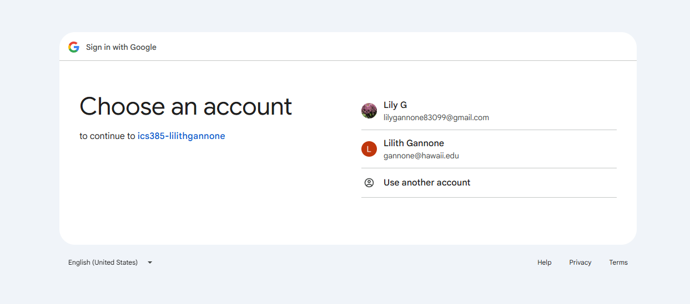
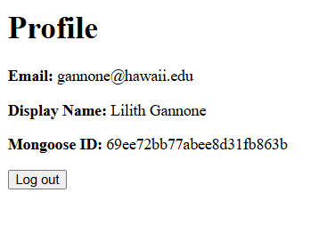
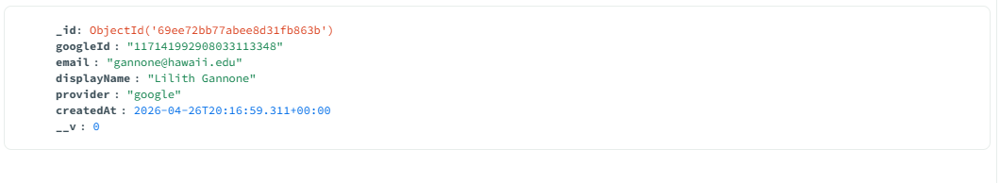

# HW15-A

A small Express application that integrates the passport-google-oauth20 strategy and demonstrates a complete "Sign in with Google" flow against credentials you obtained from Google Cloud Console.

## Name 
Lily Gannone

## AI Disclosure
Generated with the help of Codex. All primary planning and file structure change done manually. Codex was used as a coding tool, assisting with understanding and base code for ejs files.

## Reflection
### What did Google OAuth simplify?
Google OAuth simplified the authentication process by allowing users to sign in with their existing Google account. On the user side, this eliminates the need to create a new account and remember credentials. On the developer side, it takes care of the complexities and security concerns of handling user authentication within the application. For example, if a user forgets their password, they can use Google's password recovery process instead of the application implementing its own. In addition, Google implements its own MFA and security measures-- taking away some of the responsibility of securing user accounts from the application.
### What new responsibilities did it add to your application?
Integrating Google OAuth added the responsibility of securely handling user data received from Google, such as email and profile information. The application also needs to make sure that authentication tokens are properly managed. It's important that only authenticated users can access certain routes, which is why we implemented the ensureAuthenticated middleware. It also requires the application to handle the redirect to Google's authentication page and the callback route.

## Screenshots
### Google Consent Screen

### Profile Page

### MongoDB User Document

