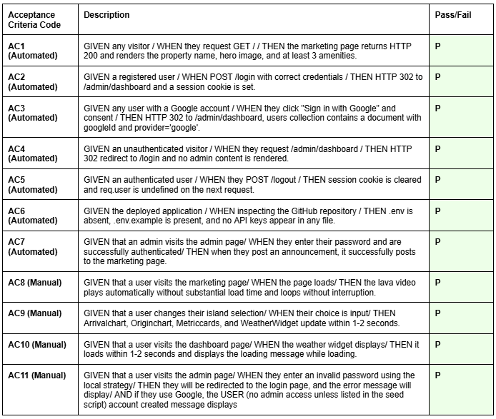
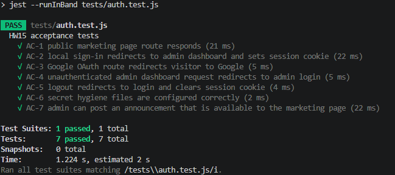

# Term Project

## Project Title
Full Stack  Website: Lava Birds B&B 

### Live URL: *Placeholder*

## Name 
Lily Gannone

## Chosen Island & Property Type
- **Island:** Big Island, Hawai'i (Hawaii Island) 
- **Property Type:** Vacation Rental (B&B) 

## Target Visitor Segment
Honeymooners: The target visitor segment for Lava Birds B&B is budget-conscious honeymooning couples. Lava Birds B&B will cater to honeymooners, anniversary celebrators, and those looking for an affordable, cozy getaway that highlights the natural beauty of the local environment. Families and solo travelers will also be targeted, but the primary focus will be on honeymooning couples. Per the tourism dashboard, this is a niche market. Tailoring the offerings to this segment will allow for a focused approach. There are many opportunities to expand offerings to other segments.

## AI Disclosure
Generated with the help of ChatGPT and Codex. All primary planning and file structure changes done manually. Codex was used as a coding tool, assisting with understanding and developing complex code. Please see the Weekly Reflections document in the data folder for details and to affirm understanding. 

## Setup Steps
1. Install Node.js and have a MongoDB database available.
2. From the repo root, run npm install.
3. Create a .env file from .env.example (line 1) with:
    - MONGO_URI=...
    - VITE_WEATHER_KEY=...
    - SESSION_SECRET=...
    - Google Auth credentials if using Google OAuth 
4. Seed the property database with npm run seed.
5. Create or promote to an admin account with `node seed-admin.js`- not committed to GitHub. 
6. Start the Express backend with npm start.
7. In a second terminal, start the Vite frontend with npm run client.
8. Open the frontend in the browser, usually http://localhost:5173/.

## Render Deployment
Use a Render Web Service, not a Static Site.

- Build Command: `npm install && npm run build`
- Start Command: `npm start`
- Environment Variables:
  - `MONGO_URI`
  - `SESSION_SECRET`
  - `VITE_WEATHER_KEY`
  - `GOOGLE_CLIENT_ID`
  - `GOOGLE_CLIENT_SECRET`
  - `NODE_ENV=production`

The Express server serves the built React app from `dist/` and keeps admin pages under `/admin`.

## Technology Stack
- Frontend: React, JSX, CSS
- Frontend build tool: Vite
- Routing: React Router DOM
- Charts/data visualization: Chart.js and react-chartjs-2
- Backend: Node.js with Express
- Database: MongoDB
- Database library: Mongoose
- Authentication: Passport.js, passport-local, bcrypt
- Sessions: express-session with connect-mongo
- Server-rendered admin pages: EJS
- API/data format: JSON REST-style API routes
- Environment variables: dotenv with .env
- Static assets: images/video in public/assets
- Development tools: npm scripts, Postman (testing)
- Authentication: local and Google OAuth (optional)
- Security: Helmet, CORS, express-validator
- External API: OpenWeather and USGS Volcano API
- Testing: Jest and Supertest 

## Acceptance Criteria

  
AC1-7 were tested with the automated tests in tests/auth.test.js. AC8-11 were manually tested in the browser.
